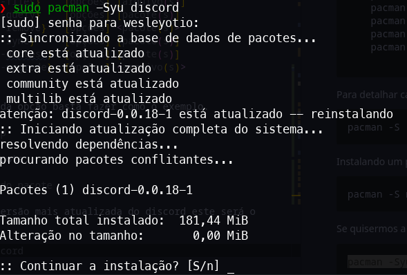
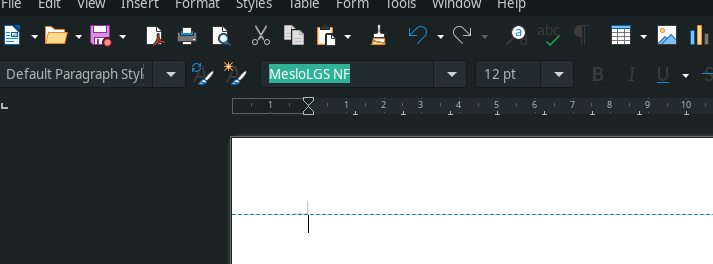

 # Guia de configuração para distro Manjaro

 Atualmente estou utilizando esta distro e para auxiliar desenvolvedores, inclusive eu, na configuração deste ambiente e pra você que achou isso perdido na internet e não quer perder tempo segue o índice pra pular pro que realmente importa. :point_down:

Índice

1. [Instalação do S.O](#instalação-do-so)
    - Site oficial
    - Xfce,KDE,Gnome...
    - Usando o Rufus
    - Instalando o manjaro
    - Pos-instalação do manjaro
2. [Conhecendo os gerenciadores de pacotes](#gerenciadores-de-pacotes)
    - [Pacman](#pacman)
    - [Yay](#yay)
4. Configurando o terminal e o VScode
    - Zsh
    - Oh-my-zsh
    - plugins
    - Vscode
5. Extras


# Instalação do S.O

Acessando o site oficial do [manjaro](https://manjaro.org/download/) você poderá escolher qual das interfaces gráficas do S.O deseja utilizar, para a maquina que configurei estou usando XFCE, mas o sistema possui tres oficiais XFCE,KDE e Gnome.


Se você preferir existem varias opções desenvolvidas pela própria comunidade escolha a que melhor te agrada.


Escolhida sua interface agora vamos baixar a ISO diretamente ou via torrent caso sua internet seja muito lenta. Download concluído é hora de usar um programa para deixar nosso pendrive bootável, se estiver usando Windows eu aconselho usar o [rufus](https://rufus.ie/pt_BR/) por ser muito simples e rápido.

Como o objetivo desse manual não é focar na instalação e configuração inicial do S.O vai aqui dois videos do canal [Diolinux](https://www.youtube.com/channel/UCEf5U1dB5a2e2S-XUlnhxSA) que mostra a instalação e apresentação inicial do sistema.
 * [Instalação do manjaro](https://www.youtube.com/watch?v=Mylcz7zSgS8&t=819s)
 * [Pós-instalação do manjaro](https://www.youtube.com/watch?v=fCoHdnKhNuw&t=746s)
  
# Gerenciadores de pacotes

Vou supor que tenha visto os videos acima e agora vou tentar explicar como funcionam os gerenciadores de pacotes do Manjaro.

## Pacman
  Aqui vou somente apresentar como é usado para esta configuração, mas vou deixar aqui o [link](https://wiki.archlinux.org/title/Pacman_(Português)) para você ler e entender melhor o funcionamento deste gerenciador, segue alguns exemplos.


Para mostra a lista de opções.
```sh
 pacman --help
  ```
Temos como resultado estes comandos.
```sh
uso:  pacman <operação> [...]
operações:
    pacman {-h --help}
    pacman {-V --version}
    pacman {-D --database} <opções> <pacote(s)>
    pacman {-F --files}    [opções] [arquivo(s)]
    pacman {-Q --query}    [opções] [pacote(s)]
    pacman {-R --remove}   [opções] <pacote(s)>
    pacman {-S --sync}     [opções] [pacote(s)]
    pacman {-T --deptest}  [opções] [pacote(s)]
    pacman {-U --upgrade}  [opções] <arquivo(s)>

  ```
Para detalhar cada opção basta fazer como o exemplo.
  ```sh
 pacman -S --help
  ``` 
Instalando um pacote.
  ```sh
 pacman -S nome_do_pacote
  ```
Se quisermos a versão mais atualizada do discord este será o comando.
  ```sh
 pacman -Syu discord
  ```
  Neste ponto vale a pena explicar o que cada flag realiza
  * -S: Instalar 
  * -y: Baixa os pacotes novos do servidor
  * -u  atualiza os pacotes instalados.
  
  No caso este pacote já se encontra atualizado em sua versão mais recente e aqui é solicitado reinstalação, como mostrado na figura a seguir.

  

## Yay

Até onde eu vi a principal diferença entre o pacman e Yay se deve ao fato de de yay conseguir fazer a instalação de pacotes oficiais da distro quanto de pacotes da comunidade chamados de AUR, mais uma vez segue o [link](https://github.com/Jguer/yay) do projeto e a seguir os passos.

  ```sh
 pacman -S --needed git base-devel
  ``` 
É uma boa usar a pasta /tmp somente para baixar o bin para instalação pois posteriormente esse arquivo sâo será mais usado.

  ```sh
 cd /tmp
 git clone https://aur.archlinux.org/yay.git
  ```
Agora entramos na pasta do projeto e executamos o comando de instalação

 ```sh
 cd yay
 makepkg -si
  ``` 
Com a instalação concluída pode usar mesma sintaxe do pacman que funciona de boas.

# Configurando o terminal e o VScode

Agora chegamos na parte mais legal e que me deu mais trabalho até agora. A ideia é deixa nosso terminal mais "bonitinho" com algumas informações relevantes e bem performático. Para isso vamos começar instalando o [zsh](https://www.zsh.org).

Primeiro verificamos qual o SHELL estamos usando no momento. 
```sh
echo $SHELL
```
provavelmente essa será sua resposta
```sh
/usr/bin/bash
```
Isso indica que nosso SHELL padrão é o bash, agora vamos instalar o zsh usando pacman ou yay você que escolhe.
```sh
sudo yay -S zsh
```
Feito isso, voce pode nota que o zsh não é iniciado imediatamente para isso precisamos torna-lo nosso SHELL padrão, mas antes vamos listas todos os SHELLs instalados na maquina.
 ```sh
chsh -l
```
Teremos alguma resposta semelhante a esta.
 ```sh
/bin/sh
/bin/bash
/bin/zsh
/usr/bin/zsh
/usr/bin/git-shell
```
E por fim usamos o comando.

 ```sh
chsh -s caminho_do_shell_escolhido
```
Agora que temos o zsh instalado vamos deixa-lo "bonitinho", pra isso precisamos de fontes que suportem ícones. Eu uso a **MesloLGS**

- [MesloLGS NF Bold Italic](fonts/MesloLGS/MesloLGS%20NF%20Bold%20Italic.ttf)
- [MesloLGS NF Bold](fonts/MesloLGS/MesloLGS%20NF%20Bold.ttf)
- [MesloLGS NF Italic](fonts/MesloLGS/MesloLGS%20NF%20Italic.ttf)
- [MesloLGS NF Regular](fonts/MesloLGS/MesloLGS%20NF%20Regular.ttf)

Com as fontes baixadas agora vc deve criar um diretório com essa fonte no diretório de fontes do sistema.

```sh
sudo mkdir meslolgs /usr/share/fonts
```
Agora no diretório onde se encontram as fonts basta copiar para a pasta recém criada

 ```sh
cp nome_fonte /usr/share/fonts/meslolgs 
```
**OBS:** Os emojis não são apresentados corretamente nesta distro, para corrigir isso basta executar o seguinte comando no terminal

```
yay -S noto-fonts-emoji
```

Verifique se a fonte está ativa procurando por ela em qualquer editor de texto, você provavelmente verá algo como a imagem a seguir.



Agora damos inicio a instalação do framework que gerencia as configurações do Zsh o famoso [Oh-My-Zsh](https://ohmyz.sh) aqui também deixo o [link](https://medium.com/tech-notes-and-geek-stuff/install-zsh-on-arch-linux-manjaro-and-make-it-your-default-shell-b0098b756a7a) de um dos artigos que me ajudaram a fazer essa configuração.

**OBS:** O comando a seguir só ira funcionar se antes você possui o git e o wget instalados, caso não tenha use estes scripts.

```sh
sudo yay -Syu
sudo yay -S git
sudo yay -S wget
```
Para verificar se tudo deu certo mesmo basta averiguar as versões dos pacotes instalados.
```sh
git --version
wget --version
```

Para realizar a instalação basta executar o script
```sh
sh -c "$(wget -O- https://raw.githubusercontent.com/ohmyzsh/ohmyzsh/master/tools/install.sh)"
```

Agora vamos a instalacao dos plugins que tornarão nosso zsh realmente poderoso.

#### **zsh-z**
 Permite que consultemos rapidamente diretórios acessados com frequência ou recentemente.

 ```sh
 git clone https://github.com/agkozak/zsh-z ${ZSH_CUSTOM:-~/.oh-my-zsh/custom}/plugins/zsh-z
 ```

 #### **zsh-autosuggestions**
 Tendo como base nosso historico de uso do terminal esse plugin sugere qual comando estamos querendo executar e com um seta direita ele escreve o comando.

 ```sh
 git clone https://github.com/zsh-users/zsh-autosuggestions ${ZSH_CUSTOM:-~/.oh-my-zsh/custom}/plugins/zsh-autosuggestions
 ```

 #### **zsh-syntax-highlighting**
 Torna o terminal interativo permitindo destaque aos comandos executados pelo Zsh enquanto eles são digitados

 ```sh
 git clone https://github.com/zsh-users/zsh-syntax-highlighting.git ${ZSH_CUSTOM:-~/.oh-my-zsh/custom}/plugins/zsh-syntax-highlighting
 ```
Agora com nossos plugins instalados precisamos ativa-los, para isso precisamos editar o arquivo de configuração do Oh-my-zsh.

```sh
nano ~/.zshrc
```
Basta adicionar o nome dos plugins instalados, salvar e reiniciar o terminal. O seu deve ficar assim.

```sh
plugins=(
  git
 
  zsh-z

  zsh-autosuggestions
  
  zsh-syntax-highlighting
  
  )
```
Para finalizarmos a instalação do terminal vamos instalar  e configurar o [powerlevel10k](https://github.com/romkatv/powerlevel10k)

```sh
git clone https://github.com/romkatv/powerlevel10k.git $ZSH_CUSTOM/themes/powerlevel10k

```
Editamos novamente arquivo de configuração do Oh-my-zsh.

```sh
nano ~/.zshrc
```

E alteramos o valor da linha ZSH_THEME

```sh
ZSH_THEME="powerlevel10k/powerlevel10k"
```
Ao reiniciarmos o terminal o powerlevl10k pede que você configure sua aparência, nesse momento se você não possuir nenhuma Nerd Fonts instalada os ícones não serão reconhecidos no sistema.
Quando desejar mudar novamente a aparência do tema execute o script.
 ```sh
 p10k configure
 ```
Agora seguimos para a instalação do VScode, vamos usar nesse caso novamente o o gerenciador de pacotes yay, pois o pacote usado pertence a comunidade do AUR do [Arch linux](https://aur.archlinux.org/packages/visual-studio-code-bin) a instalação  é semelhante ao a do yay.
```sh
cd /tmp
git clone https://aur.archlinux.org/visual-studio-code-bin.git
cd visual-studio-code-bin
makepkg -si
```
Agora temos o VScode instalado, mas nosso terminal integrado está reconhecendo nossas fontes então precisamos configurar isso. Então em **configurações** digite *terminal.fontfamily* você verá a fonte usada no momento, basta mudar para nossa fonte baixada e seu ambiente está pronto.  

# Extras
A partir daqui segue as configurações/aplicações que fazem parte de minha rotina.

### Docker
 Aqui eu usei o **pacman** mas deixo o [link](https://wiki.archlinux.org/title/docker) pra quem quiser usar o yay.

Instalação
```sh
sudo pacman -S docker
sudo pacman -S docker-compose
```
Para inicializar ou desligar use 
```sh
sudo systemctl start docker.service
sudo systemctl stop docker.service
```
Use esse comando para verificar o docker está ativo. 
```sh
docker ps
```
Caso queria iniciar o docker junto com sua maquina sempre use.

 ```sh
sudo systemctl enable docker.service
```
### OpenVPN

Este tópico foi criado para demonstrar um caso especifico onde a conexão com a VPN acontece, mas o usuário perde o acesso a internet.

Antes de iniciar, instale os softwares `openvpn` e `NetworkManager-OpenVPN` pelo pacman ou yay pelo comando

```sh
yay -S networkmanager-openvpn
```
```sh
yay -S openvpn
```
Pronto, a partir de agora vou considerar que possui um arquivo de configuração da vpn `myvpn.ovpn` junto de um usuário e senha.
Copie o arquivo de configuração para o diretório da mostrado pelo comando.
```sh
sudo cp /caminho/para/o/arquivo/myvpn.opvpn /etc/openvpn/
```

Agora edit o arquivo usando o nano
```sh
sudo nano /etc/openvpn/myvpn.opvpn 
```

edit a linha que contêm `auth-user-pass` para ficar assim. 
```sh
auth-user-pass /etc/openvpn/mycredentials.txt
```
em seguida crie o arquivo no diretório especificado no comando anterior e coloque seu usuário e senha

```sh
user
password
```
Pronto, agora use o seguinte comando para testar sua conexão

```sh
sudo openvpn /etc/openvpn/myconfig.opvpn
```
Feito isso observe se consegue ter conexão com a internet, se sim então seu arquivo de configuração está correto e você poderá fazer também na interface gráfica. Caso o acesso a internet não esteja funcionando observe se sua saída tem algo parecido como esse apresentado. 

```sh
2023-03-26 00:37:20 [NEW-OPENVPN] Peer Connection Initiated with [AF_INET]10.10.10.10:1194
2023-03-26 00:37:24 Options error: Cannot set comp-lzo to 'yes', allow-compression is set to 'no'
2023-03-26 00:37:24 TUN/TAP device tun0 opened
2023-03-26 00:37:24 net_iface_mtu_set: mtu 1500 for tun0
2023-03-26 00:37:24 net_iface_up: set tun0 up
2023-03-26 00:37:24 net_addr_v4_add: 15.15.18.2/24 dev tun0
2023-03-26 00:37:24 Initialization Sequence Completed
2023-03-26 00:37:33 write to TUN/TAP : Invalid argument (fd=-1,code=22)
2023-03-26 00:37:43 write to TUN/TAP : Invalid argument (fd=-1,code=22)
2023-03-26 00:37:53 write to TUN/TAP : Invalid argument (fd=-1,code=22)
```
Para casos como mostrado acima o problema acontece pelo fato do servidor Openvpn está habilitado para permitir compressão, mas o seu cliente está configurado para desativar a compressão. Para corrigir esse problema basta editar seu arquivo **myconfig.opvpn** e adicionar a seguinte linha

```sh
comp-lzo yes //ou comp-lzo no caso seu servidor não tenha habilitado compressão
```
Agora repita o processo e a conexão estará funcionando corretamente.
Para realizar o mesmo processo pela interface gráfica basta fazer os seguintes passos:

  1. Clique com o botão direito no ícone de sua rede ativa.
  2. Navegue pelo menu **Conexões VPN** > **Configurar VPN**
  3. Clique no ícone **+** para adicionar uma nova conexão
  4. Selecione a opção ***Importar uma configuração de VPN salva***
  5. Selecione  seu arquivo **myconfig.opvpn** 
  6. Adicione seu usuário e senha, salve e sua VPN está pronta para conexão no menu  **Conexões VPN**
