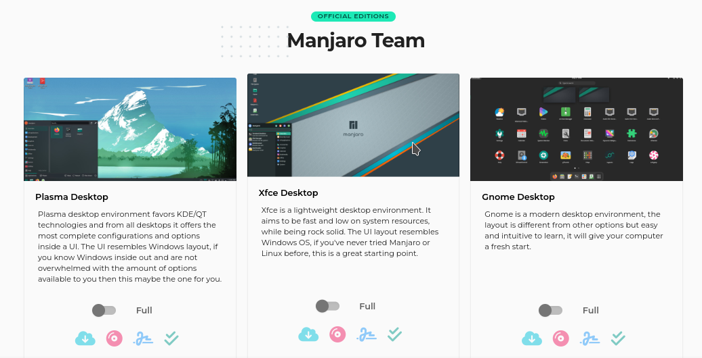
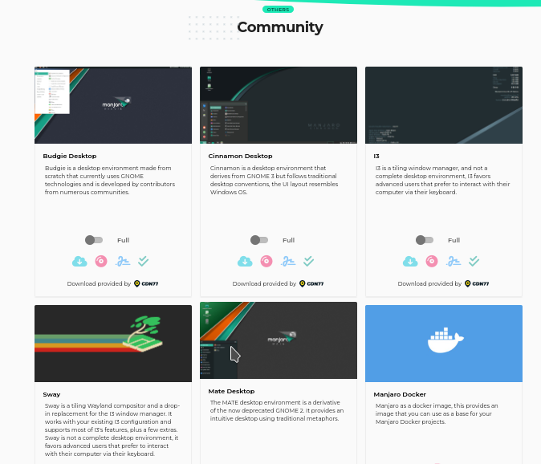

 # Guia de configuração para distro Manjaro

 Atualmente estou utilizando esta distro e para auxiliar desenvolvedores, inclusive eu, na configuração deste ambiente e pra você que achou isso perdido na internet e não quer perder tempo segue o índice pra pular pro que realmente importa. :point_down:

Índice

1. Instalação do S.O
    - Site oficial
    - Xfce,KDE,Gnome...
    - Usando o Rufus
    - Instalando o manjaro
    - Pos-instalação do manjaro
2. Conhecendo os gerenciadores de pacotes
3. Configurando o terminal e o VScode
4. Extras

# Instalação do S.O

Acessando o site oficial do [manjaro](https://manjaro.org/download/) você poderá escolher qual das interfaces gráficas do S.O deseja utilizar, para a maquina que configurei estou usando XFCE, mas o sistema possui tres oficiais XFCE,KDE e Gnome.

Se você preferir existem varias opções desenvolvidas pela própria comunidade escolha a que melhor te agrada.

Escolhida sua interface agora vamos baixar a ISO diretamente ou via torrent caso sua internet seja muito lenta. Download concluído é hora de usar um programa para deixar nosso pendrive bootável, se estiver usando Windows eu aconselho usar o [rufus](https://rufus.ie/pt_BR/) por ser muito simples e rápido.

Como o objetivo desse manual não é focar na instalação e configuração inicial do S.O vai aqui dois videos do canal [Diolinux](https://www.youtube.com/channel/UCEf5U1dB5a2e2S-XUlnhxSA) que mostra a instalação e apresentação inicial do sistema.
 * [Instalação do manjaro](https://www.youtube.com/watch?v=Mylcz7zSgS8&t=819s)
 * [Pós-instalação do manjaro](https://www.youtube.com/watch?v=fCoHdnKhNuw&t=746s)
  
  
